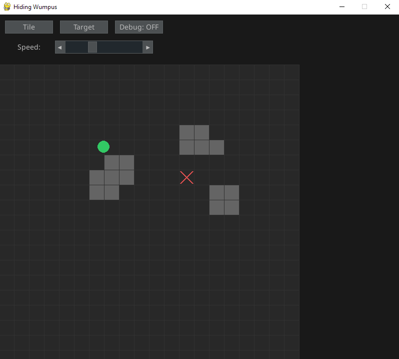

# Hiding Wumpus

A hide-and-seek sort of game where one NPC hides from you or another NPC.

For CPSC 481 Spring 2025.

## Development quick start

1. Clone this repository.
1. Make a virtual python environment and install the required python packages.
    - If you open this project in Visual Sudio Code, you can open one of the python files,
    click the Python in the status bar at the bottom of the screen, click "Create Virtual Environment...",
    choose your Python version (3.12.3 is preferred), and it will also guide you to install the required packages in requirements.txt.
    - Alternatively, you can do this in the terminal. Run `python -m venv .venv` to make a new virtual environment in the ".venv" directory, then activate it using one of the activation scripts inside (for Windows Command Prompt, it's `.\.venv\Scripts\activate.bat`, for others [see here](https://docs.python.org/3/library/venv.html)), then run `pip install -r requirements.txt`.
    - If you want Visual Studio's syntax highlighting and autocompletion to work well, you'll need to tell it to use the virtual environment.
1. Run the program by typing `python main.py` in the terminal.

## Disclaimer

This project stems from a basic LLM-generated A* pathfinding algorithm visualizer.

This is what that looked like:

